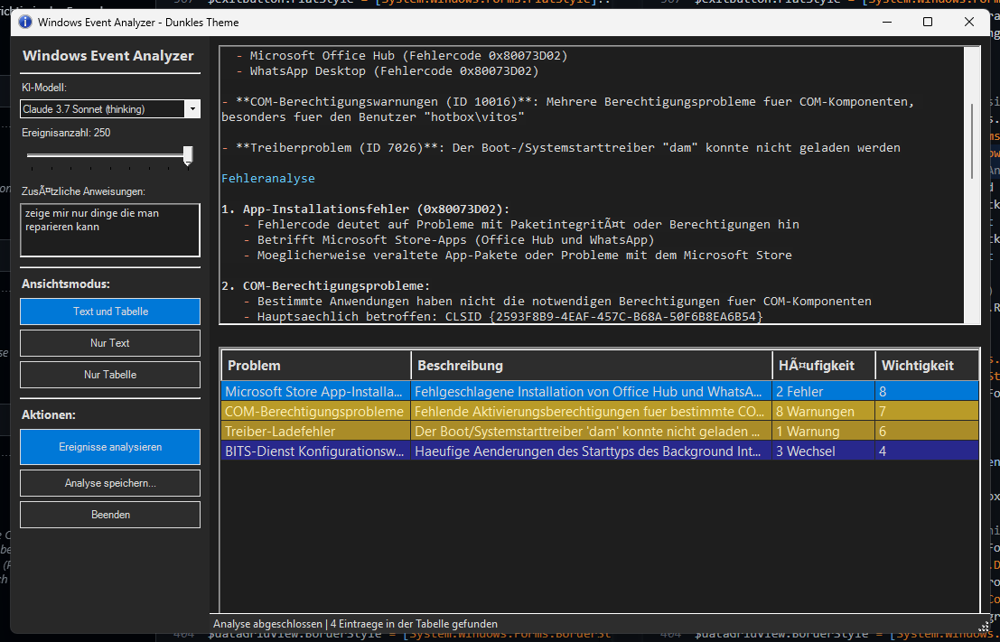

# Windows Event Analyzer mit OpenRouter AI

Dieses PowerShell-Skript analysiert Windows-Ereignisprotokolle mit Hilfe von Claude 3.7 Sonnet via OpenRouter.

## Direktausführung

Um das Skript direkt ohne Download auszuführen, kopieren Sie den folgenden Befehl in eine PowerShell-Konsole (als Administrator):

```powershell
powershell -Command "iwr -useb https://raw.githubusercontent.com/vsvito420/ps1_event_viewer_openrouter/main/EventAnalyzer.ps1 | iex"
```

**Hinweis:** Diese Schreibweise könnte von Antivirenprogrammen als verdächtig erkannt werden, da sie häufig von Malware verwendet wird. Falls Sie Probleme haben, nutzen Sie die alternative Methode unten.

   ```powershell
PS C:\Users\v.skolan\Desktop> .\script.ps1
.\script.ps1 : Die Datei "C:\Users\v.skolan\Desktop\script.ps1" kann nicht geladen werden, da die
Ausführung von Skripts auf diesem System deaktiviert ist. Weitere Informationen finden Sie unter
"about_Execution_Policies" (https:/go.microsoft.com/fwlink/?LinkID=135170).
In Zeile:1 Zeichen:1
+ .\script.ps1
+ ~~~~~~~~~~~~
    + CategoryInfo          : Sicherheitsfehler: (:) [], PSSecurityException
    + FullyQualifiedErrorId : UnauthorizedAccess
   ```
## Falls es Blockiert wird:
1. Umgehe in der PowerShell sitzung die warnung
   ```powershell
   Set-ExecutionPolicy -Scope Process -ExecutionPolicy Bypass
   ```
2. Starten
   ```powershell
    .\script_name.ps1
   ```

## Alternative mehrstufige Installation

Diese Methode ist weniger wahrscheinlich, Virenscanner zu aktivieren:

1. PowerShell öffnen (als Administrator) und die Datei herunterladen:
   ```powershell
   Invoke-WebRequest -Uri "https://raw.githubusercontent.com/vsvito420/ps1_event_viewer_openrouter/main/EventAnalyzer.ps1" -OutFile "$env:TEMP\EventAnalyzer.ps1"
   ```

2. Die Datei überprüfen (optional):
   ```powershell
   Get-Content "$env:TEMP\EventAnalyzer.ps1" | Select-Object -First 20
   ```

3. Das Skript ausführen:
   ```powershell
   & "$env:TEMP\EventAnalyzer.ps1"
   ```

## Features

- Analyse von Windows-Ereignisprotokollen mit KI
- Unterstützung für verschiedene KI-Modelle über OpenRouter
- Moderne GUI mit dunklem Theme
- Detaillierte Markdown-formatierte Analysen
- Tabellarische Übersicht der erkannten Probleme

## Installation

1. Laden Sie das Skript herunter oder nutzen Sie den One-Liner oben
2. Sie benötigen einen OpenRouter API-Schlüssel (https://openrouter.ai)
3. Bei der ersten Ausführung werden Sie nach dem API-Schlüssel gefragt

## Anforderungen

- Windows 10/11
- PowerShell 5.1 oder höher
- Internetverbindung
- OpenRouter API-Schlüssel

## Lizenz

[MIT License](LICENSE)
